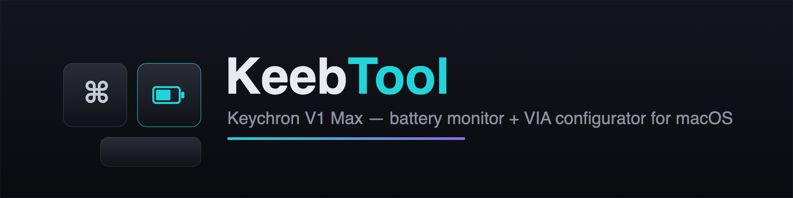
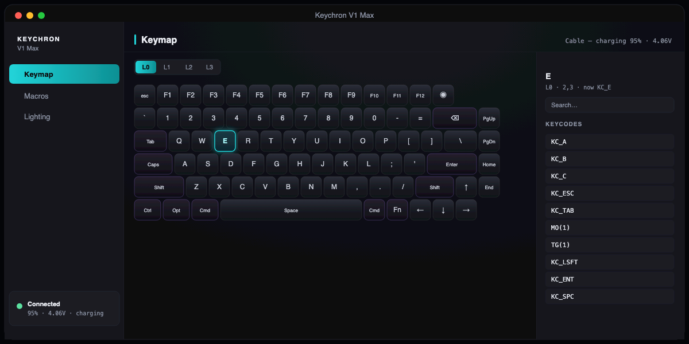

<p align="center">
  
</p>

<p align="center">
  
  
  
  
</p>

# Keychron V1 Max — battery monitor + VIA configurator (macOS)

A native macOS menu-bar app for the **Keychron V1 Max**: see the battery level (which stock
firmware does not expose over USB), and configure the keyboard — remap keys, edit macros, and
control RGB lighting — over the VIA raw-HID protocol. Ships with a small QMK firmware patch that
adds a battery read-out command and an Fn+B on-board battery gauge.

<p align="center">
  
</p>

## Features

- 🔋 **Battery in the menu bar** — live %/voltage over USB; charging-aware with smoothing; last-known value over the 2.4 GHz dongle with a timestamp.
- ⌨️ **Keymap remap** — visual V1 Max layout per layer + keycode picker, written live.
- 🅼 **Macros** — read, edit and write the keyboard's macro slots.
- 🌈 **RGB lighting** — effect, brightness, speed, hue/saturation; saved to the keyboard.
- 🛠 **Firmware patch** — `0xA4` battery command over USB + an Fn+B on-board colour gauge.

## The app — `app/KeebTool`

Native Swift (AppKit menu bar + SwiftUI), built with SwiftPM.

- **Battery in the menu bar** — always visible, no window to open.
  - **Over the USB cable:** live percentage + voltage via the custom `0xA4` firmware command.
    While charging the voltage-based % reads high, so the app flags charging (⚡) and smooths the
    value; the last on-battery reading is kept as the truest "resting" charge.
  - **Over the 2.4 GHz dongle:** the keyboard reports battery only at (re)connect (a hardware
    limit of the dongle — see [docs/dongle-battery.md](docs/dongle-battery.md)); the app listens
    on the dongle's `0x008C` channel and shows the last value with a timestamp.
- **Keymap** — visual V1 Max layout per layer + keycode picker → live remap.
- **Macros** — read/edit/write the keyboard's macro slots.
- **Lighting** — RGB matrix effect, brightness, speed, hue/saturation; save to the keyboard.

### Build & run

```sh
cd app/KeebTool
make app        # swift build -c release + assemble KeebTool.app
make run        # build and launch
```

Requires macOS 13+ and the Swift toolchain (`swift --version`). The app is a menu-bar
(`LSUIElement`) agent; click the battery icon for details and "Open Configurator…".

## The firmware patch — `firmware/battery-0xA4.patch`

A small change to `Keychron/qmk_firmware` (`wireless_playground`):

- **`0xA4` = `KC_GET_BATTERY`** raw-HID command → returns battery percentage + voltage over USB.
- **Fn+B on-board battery gauge** — lights the number row by level with colour: red (<30%),
  amber (<60%), green otherwise.
- Periodic + on-connect battery push to the wireless module.

### `0xA4` response layout (32-byte raw-HID report)

| byte      | meaning                          |
|-----------|----------------------------------|
| `data[0]` | `0xA4` (echo)                    |
| `data[1]` | battery percentage, 0–100        |
| `data[2]` | battery voltage low byte (mV)    |
| `data[3]` | battery voltage high byte (mV)   |

Voltage is little-endian: `mV = data[2] | (data[3] << 8)`.

## Hardware / protocol facts

- USB VID `0x3434`; V1 Max ANSI-encoder cable PID `0x0913`, 2.4 GHz dongle PID `0xD030`.
- raw-HID interface: usage page `0xFF60`, usage `0x61`, 32-byte reports.
- Dongle battery channel: usage page `0x008C` (byte 0 = percentage).
- MCU: STM32 (ChibiOS) with a DFU bootloader → flashed with `dfu-util`.
- Upstream: `Keychron/qmk_firmware` @ `wireless_playground`, target
  `keychron/v1_max/ansi_encoder`, keymap `via`.

## Build the firmware (macOS, Apple Silicon)

The Homebrew `qmk` formula can be broken and the core `arm-none-eabi-gcc` ships without newlib;
this recipe works:

```sh
# qmk CLI via venv
python3 -m venv ~/.qmk-venv && ~/.qmk-venv/bin/pip install qmk
# ARM toolchain WITH newlib
brew tap osx-cross/arm && brew install osx-cross/arm/arm-gcc-bin@14
brew install dfu-util
# fork + deps
git clone --depth 1 -b wireless_playground https://github.com/Keychron/qmk_firmware.git ~/keychron-qmk
git -C ~/keychron-qmk submodule update --init --recursive
~/.qmk-venv/bin/pip install -r ~/keychron-qmk/requirements.txt
# apply patch + build
git -C ~/keychron-qmk apply /path/to/firmware/battery-0xA4.patch
export PATH="/opt/homebrew/opt/arm-gcc-bin@14/bin:$PATH"
~/.qmk-venv/bin/qmk compile -kb keychron/v1_max/ansi_encoder -km via
```

## Flashing

1. Mode switch → **Cable**; hold **Esc** and plug in the USB-C cable → STM32 ROM DFU bootloader.
2. Flash:

   ```sh
   dfu-util -a 0 -d 0483:df11 -s 0x08000000:leave -D firmware/build/keychron_v1_max_ansi_encoder_via.bin
   ```

   A one-time `Transitioning to dfuMANIFEST` / non-zero exit on the leave request is a benign
   dfu-util quirk — the firmware is written.
3. **Rollback:** flash `firmware/stock/keychron_v1_max_ansi_encoder_via.bin` the same way. The
   STM32 ROM bootloader cannot be bricked.

## Repo layout

```
app/KeebTool/     macOS app (SwiftPM): menu-bar battery + VIA configurator
firmware/
  battery-0xA4.patch                  the firmware change, as a diff vs upstream
  build/  keychron_v1_max_..._via.bin  patched build (flash this)
  stock/  keychron_v1_max_..._via.bin  stock firmware (rollback)
docs/             protocol notes + the 2.4 GHz dongle battery write-up
```

## Licensing

MIT for the macOS app and tooling. The firmware patch is a diff against Keychron's QMK fork and
follows upstream **GPLv2+**. See [LICENSE](LICENSE).
